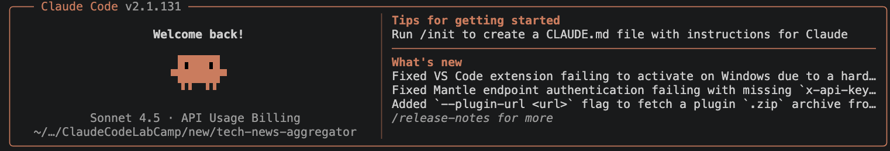

# Tech News Aggregator Workshop Guide

**Welcome to the hands-on ClaudeCode workshop!** 

In this lab, you'll build your own Tech News Aggregator from scratch, learning professional development workflows with Claude Code. By the end, you'll have a working full-stack application that aggregates and analyzes tech news using AI.

---

## 📌 Important: Workflow Clarification

**Instructor's repo is read-only reference. You'll work in your own fork:**

1. **Clone instructor's repo** (StormAIDE/ClaudeCodeLabCamp - read-only reference)
2. **Test the completed app** on `main` branch to see what you're building
3. **Fork to your own GitHub** (creates `yourusername/ClaudeCodeLabCamp`)
4. **Change git remote** to your fork
5. **Create workshop branch** in your fork (`workshop/<your-name>`)
6. **Build from scratch** on your branch following this guide
7. **Push to your fork** (not instructor's repo)
8. **Compare with instructor's `main`** when stuck

**Two repos: Instructor's = reference (read-only). Your fork = workspace (push here).**

---

**Workshop Philosophy: "Add Feature → Test Feature → See The Improvement"**

After adding each Claude Code service (plugins, commands, hooks, skills, agents, MCP), you'll immediately test it and see how it improves your development workflow!

---

## What You'll Build

**Project:** A Tech News Aggregator that:
- Searches for recent tech news articles (AI, Cloud, DevOps, Web Dev, etc.)
- Categorizes articles by technology domain  
- Summarizes article content
- Shows trending tech topics
- Stores article history in SQLite database
- Provides a chat interface + visual news feed

**Tech Stack:**
- Backend: Python + FastAPI + Strands SDK
- Frontend: React + TypeScript + Vite
- Database: SQLite for article storage
- AI: Claude via Amazon Bedrock

---

## Prerequisites

**Must be installed BEFORE workshop:**

These cannot be installed by Claude Code - you need them first:

- [ ] **Python 3.13** 
- [ ] **Node.js 18+** (download from [nodejs.org](https://nodejs.org))
- [ ] **Git** (download from [git-scm.com](https://git-scm.com))
- [ ] **VS Code or terminal** (any terminal works)
- [ ] **AWS account with Bedrock access**
- [ ] **AWS credentials configured** (claudecodelabcampparticipants profile)

**Check your setup:**
```bash
python3.13 --version    # Must show 3.13.x
node --version          # Must show 18+
git --version           # Any recent version
```

**Claude Code will install for you:**
- ✅ Python packages (FastAPI, Strands SDK, pytest, etc.)
- ✅ npm dependencies (React, Vite, TypeScript, etc.)
- ✅ GitHub CLI (optional, for PR workflows)
- ✅ Virtual environment setup

---

## Getting Started: Setup Before Workshop

### Step 1: Install Claude Code CLI

#### Option 1: Install in VS Code Terminal (Mac - Recommended)

```bash
# Install Claude Code CLI
curl -fsSL https://claude.ai/install.sh | bash
```

**Verify installation:**
```bash
claude --version
# Should display: Claude Code v[version number]
```

**If command not found:**
- Close and reopen terminal (shell needs to reload PATH)
- Or run: `source ~/.zshrc` (Mac/Linux) or `source ~/.bashrc` (Linux)

#### Option 2: Install for Other Operating Systems

**Follow the official installation guide:**

👉 **[https://code.claude.com/docs/en/quickstart](https://code.claude.com/docs/en/quickstart)**

This guide covers Windows, Linux, macOS, Desktop App, and VS Code Extension.

---

### Step 2: Configure AWS Profile (BEFORE Starting Claude Code)

**Create AWS profile with credentials provided by instructor:**

```bash
# Create named profile
aws configure --profile claudecodeprofile
```

**When prompted, enter these values:**

```
AWS Access Key ID [None]: [paste your access key]
AWS Secret Access Key [None]: [paste your secret key]
Default region name [None]: eu-central-1
Default output format [None]: json
```


**Verify profile configured correctly:**

```bash
aws sts get-caller-identity --profile claudecodeprofile
# Should return your AWS account details
```

**Note:** You'll export AWS credentials to environment later (in Lab 1) before starting the backend.

---

## Lab 0: Setup Your Workshop Environment

**You should have already completed (from README):**
- ✅ Cloned instructor's repo: `ClaudeCodeLabCamp/`
- ✅ Tested the completed app on `main` branch
- ✅ Virtual environment created: `claudecodeenv/`
- ✅ Dependencies installed (backend + frontend)
- ✅ AWS credentials exported and verified
- ✅ Claude Code CLI installed

**Now you're ready to set up your own workspace.**

---

### Step 0.1: Verify You're in the Right Place

```bash
# Check current directory
pwd
# Should show: .../ClaudeCodeLabCamp

# Check branch
git branch
# Should show: * main

# Check remote
git remote -v
# Should show: origin  https://github.com/StormAIDE/ClaudeCodeLabCamp.git
```

---

### Step 0.2: Fork to Your Own GitHub

**Create your own fork:**

1. Go to https://github.com/StormAIDE/ClaudeCodeLabCamp
2. Click **Fork** button (top right)
3. Create fork under your account: `yourusername/ClaudeCodeLabCamp`

**Change git remote to your fork:**

```bash
# Check current remote (points to instructor's repo)
git remote -v
# origin  https://github.com/StormAIDE/ClaudeCodeLabCamp.git (fetch)
# origin  https://github.com/StormAIDE/ClaudeCodeLabCamp.git (push)

# Add instructor's repo as "upstream" (for reference)
git remote rename origin upstream

# Add YOUR fork as "origin" (where you'll push)
git remote add origin https://github.com/yourusername/ClaudeCodeLabCamp.git

# Verify
git remote -v
# origin    https://github.com/yourusername/ClaudeCodeLabCamp.git (fetch)
# origin    https://github.com/yourusername/ClaudeCodeLabCamp.git (push)
# upstream  https://github.com/StormAIDE/ClaudeCodeLabCamp.git (fetch)
# upstream  https://github.com/StormAIDE/ClaudeCodeLabCamp.git (push)
```

**Why?** You push to YOUR fork. Instructor's repo stays clean.

---

### Step 0.3: Create Your Workshop Branch

**Create new branch for your work:**

```bash
# Create and switch to workshop branch
git checkout -b workshop/<your-name>

# Example:
# git checkout -b workshop/john-smith

# Push to YOUR fork
git push -u origin workshop/<your-name>
```

**Why?** Build from scratch on this branch. Compare with `upstream/main` (instructor's reference) when stuck.

---

### Step 0.4: Clear the Workspace for Fresh Build

**Start from scratch to learn by building:**

```bash
# Remove backend/frontend (you'll rebuild these)
rm -rf backend/ frontend/

# Move instructor's files to reference folder (clear they're examples)
mkdir workshop-instructor-examples
mv .claude workshop-instructor-examples/claude-config
mv CLAUDE.md workshop-instructor-examples/CLAUDE.md

# Create fresh Claude Code config
mkdir .claude

# Keep .mcp.json (saves time in Lab 5)
# Keep WORKSHOP.md (this guide)

# Commit clean state
git add .
git commit -m "chore: prepare workspace for workshop"
git push
```

**Why this structure?**
- `workshop-instructor-examples/` — clear it's reference material, not active config
- Fresh `.claude/` — you build hooks/agents/skills from scratch
- Instructor's CLAUDE.md moved — has completed app details, would confuse Claude
- `.mcp.json` kept — Lab 5 focuses on USING MCP tools

**Don't just copy instructor's files — learn by building!**

---

**Checklist before proceeding to Lab 1:**
- [ ] Forked to your GitHub account
- [ ] Changed remotes: `origin` = your fork, `upstream` = instructor's repo
- [ ] Created workshop branch: `workshop/<your-name>`
- [ ] Currently on workshop branch: `git branch` shows `* workshop/<your-name>`
- [ ] Removed `backend/`, `frontend/` folders
- [ ] Created `workshop-instructor-examples/` folder
- [ ] Moved `.claude/` → `workshop-instructor-examples/claude-config/`
- [ ] Moved `CLAUDE.md` → `workshop-instructor-examples/CLAUDE.md`
- [ ] Created fresh `.claude/` directory
- [ ] Kept `.mcp.json` and `WORKSHOP.md`
- [ ] Pushed workspace to YOUR fork
- [ ] Virtual environment still activated: `source claudecodeenv/bin/activate`
- [ ] **AWS credentials still exported in THIS terminal** (verify: `aws sts get-caller-identity`)
- [ ] **You're in the SAME terminal** where you exported AWS creds (critical for backend)

---

## Lab 1: Connect Claude Code to Your Project

### Step 1.1: Start Claude Code in Project Directory

**⚠️ CRITICAL: Use same terminal where you exported AWS credentials.**

**Ensure you're in the repo directory and on your workshop branch:**

```bash
# Check current directory (should be ClaudeCodeLabCamp/)
pwd

# Check branch (should be workshop/<your-name>)
git branch

# Verify AWS credentials still exported (MUST pass)
aws sts get-caller-identity

# If fails, re-export:
# export AWS_ACCESS_KEY_ID=<YOUR_KEY>
# export AWS_SECRET_ACCESS_KEY=<YOUR_SECRET>
# export AWS_DEFAULT_REGION=eu-central-1

# Start Claude Code (first time)
claude
```

**Why same terminal matters:**
- Claude Code runs commands in this shell
- Backend inherits AWS env vars from shell
- Different terminal = no credentials = backend fails

**When you run `claude` for the first time, you'll see this setup prompt:**



1. **Select authentication method**: Choose **AWS Bedrock SSO**
2. **Enter AWS SSO profile name**: Type `claudecodeprofile`
3. **Enter AWS region**: Type `eu-central-1`
4. **Follow remaining prompts** to complete setup
5. **Press Enter** to restart Claude
6. **Type `claude` again** - Connection established

**What you'll see after setup:**
```
Claude Code v[version]
Connected to: ClaudeCodeLabCamp/
Branch: workshop/<your-name>
Ready to assist!
```

**Try asking:**
```
What do you see in the folder?
```

**Success!** Claude Code connected. You're on your workshop branch. Upstream/main = reference implementation.

### Step 1.2: Test Basic Commands

**Try these commands:**

```bash
# Check current directory
! pwd

# List files
! ls

# Check git status  
! git status
```

Claude Code should respond with directory info and git status!

### Step 1.3: Create Starter CLAUDE.md

**Ask Claude Code:**
```
Create a starter CLAUDE.md file with basic project info:

- Project name: Tech News Aggregator
- Goal: Learn Claude Code by building full-stack AI agent
- Tech stack: Python 3.13, FastAPI, Strands SDK, React 19, TypeScript, Vite
- Ports: Backend 8000, Frontend 5173
- Testing: pytest (backend), Vitest (frontend)
- AWS: Bedrock access required, credentials via environment variables
- Git workflow: workshop/<name> branch in forked repo

Add section: "As we build features, update this file with architecture decisions."

Keep it SHORT — detailed docs come later.
```

**Why?** Claude needs basic context. Instructor's `workshop-instructor-examples/CLAUDE.md` too detailed for empty project. You'll expand this as you build.

---

### Step 1.4: Verify GitHub Connection

**Test GitHub CLI:**

```bash
# View YOUR fork
gh repo view

# Should show: yourusername/ClaudeCodeLabCamp

# Check remotes
git remote -v
# origin = your fork
# upstream = instructor's repo

# Verify branch pushed
git branch -vv
# * workshop/<your-name> [origin/workshop/<your-name>] ...
```

**What This Enables:**
- Push work to YOUR fork
- Compare your branch with instructor's `upstream/main`
- Create PRs in your fork to track progress

---

## Lab 2: Build App + Tests with Plan Mode

### Step 2.1: Use Plan Mode to Design the App

**Enter Plan Mode:**
```
Press Shift+Tab before hitting Enter on your prompt
```

**Ask Claude Code:**
```
Create a full-stack Tech News Aggregator application with:

Backend (Python + FastAPI + Strands SDK):
- Agent with 4 tools:
  - search_news(topic: str, days: int = 7) - Find recent tech articles
  - categorize_article(text: str) - Auto-categorize by tech domain
  - summarize_article(url: str) - Generate article summaries
  - get_trending_topics() - Show trending tech topics
- SQLite database for article storage (articles table with id, title, url, summary, topic, published_date, fetched_at)
- API endpoints:
  - POST /api/v1/agent/chat - Chat with agent
  - GET /api/v1/news?topic=AI&days=7 - Get news articles
  - GET /api/v1/trending - Get trending topics
- Configuration: APP_NAME = "Tech News Aggregator", DATABASE_PATH = "./data/articles.db"

Frontend (React + TypeScript + Vite):
- ChatInterface component for agent interaction
- NewsFeed component - Display article cards with loading states
- ArticleCard component - Shows title, summary, topic badge, dates, clickable URL
- TopicFilter component - Filter buttons (All, AI/ML, Cloud/DevOps, Web Development, Mobile, Security, Data Science)
- Two-column responsive layout: Chat interface (left) + News feed (right)
- App title: "Tech News Aggregator"
- Subtitle: "Stay updated with the latest tech news - AI, Cloud, DevOps, and more"

Include full test coverage:

Backend tests (backend/tests/):
- test_news_tools.py:
  - test_search_news_returns_articles() - Verify 3 articles returned
  - test_search_news_filters_by_days() - Verify days parameter works
  - test_categorize_article_ai_ml() - Test AI/ML categorization
  - test_categorize_article_cloud_devops() - Test Cloud/DevOps categorization
  - test_summarize_article_returns_summary() - Verify summary generation
  - test_get_trending_topics_returns_list() - Verify 5 topics returned
- test_news_endpoints.py:
  - test_get_news_endpoint() - Test GET /api/v1/news
  - test_get_news_with_topic_filter() - Test ?topic=AI parameter
  - test_get_trending_endpoint() - Test GET /api/v1/trending
  - test_post_chat_endpoint() - Test POST /api/v1/agent/chat
- test_database.py:
  - test_database_initialization() - Verify articles table created
  - test_add_article() - Test article insertion
  - test_get_articles_by_topic() - Test topic filtering
  - test_get_trending_topics() - Test trending aggregation

Frontend tests (frontend/src/components/__tests__/):
- NewsFeed.test.tsx - renders topic filter buttons, calls API when topic changes, displays loading state, shows "no articles" message when empty, renders article cards when data available
- ArticleCard.test.tsx - renders article title as clickable link, displays summary text, shows topic badge, formats dates correctly
- TopicFilter.test.tsx - renders all topic buttons, highlights selected topic, calls onChange when clicked

Use mock data for articles initially (real API integration can be added later).
Follow FastAPI + React + Strands SDK architecture patterns.
Backend port: 8000, Frontend port: 5173
```

**Review the plan**, approve it, and let Claude generate the project structure with tests.

### Step 2.2: Start the App

**Ask Claude Code:**
```
Start the app
```

Claude will:
1. Activate virtual environment
2. Install dependencies (FastAPI, Strands SDK, React, etc.)
3. Start FastAPI backend on port 8000
4. Start Vite frontend on port 5173

**If backend fails with AWS error:**
```bash
# Verify credentials in current shell
aws sts get-caller-identity

# If fails, re-export (in same terminal):
export AWS_ACCESS_KEY_ID=<YOUR_KEY>
export AWS_SECRET_ACCESS_KEY=<YOUR_SECRET>
export AWS_DEFAULT_REGION=eu-central-1

# Restart Claude Code
exit  # Exit Claude Code
claude  # Start again
```

Backend reads AWS creds from shell environment, NOT from AWS profile files.

### Step 2.3: Test the Tech News Agent

**Open:** http://localhost:5173

**You should see:**
- Header: "Tech News Aggregator"
- Two-column layout: Chat (left) + News Feed (right)
- Topic filter buttons: All, AI/ML, Cloud/DevOps, etc.
- Empty news feed (database is empty)

**Test queries in the chat:**

**Query 1:**
```
What's the latest AI news this week?
```

**Expected:** Agent calls `search_news("AI", 7)` and returns 3 mock articles with titles, dates, summaries, URLs

**Query 2:**
```
What are the trending tech topics?
```

**Expected:** Agent calls `get_trending_topics()` and returns list like:
- AI - 156 articles
- Cloud Computing - 89 articles  
- Web3 - 67 articles
- Cybersecurity - 54 articles
- DevOps - 43 articles

**Query 3:**
```
Categorize this: "New Kubernetes update improves container orchestration"
```

**Expected:** Agent calls `categorize_article()` and returns "Category: Cloud/DevOps"

### Step 2.4: Run Tests

**Backend tests:**
```bash
source venv/bin/activate
python -m pytest backend/tests/ -v
```

**Frontend tests:**
```bash
cd frontend
npm test
```

**Expected:** All tests pass

**What You Just Built:**
- Full-stack app with tests in minutes!
- Agent with 4 custom tools
- React frontend with TypeScript
- FastAPI backend with Strands SDK
- SQLite database ready for articles
- Complete test coverage (backend + frontend)

---

## Lab 3: Plugins & TDD

### Step 3.1: Install TypeScript LSP Plugin

**In Claude Code:**
```
/plugin marketplace add claude-plugins-official
/plugin install typescript-lsp@claude-plugins-official
/reload-plugins
```

**Test it:**

**Ask Claude Code:**
```
In frontend/src/components/NewsFeed.tsx, intentionally add a type error:

const articles: Article[] = "not an array";  // Should error!

Check if LSP catches this.
```

**Expected:** TypeScript LSP shows error: `Type 'string' is not assignable to type 'Article[]'`

### Step 3.2: Install Pyright LSP Plugin

**In Claude Code:**
```
/plugin install pyright-lsp@claude-plugins-official
/reload-plugins
```

**Test it:**

**Ask Claude Code:**
```
In backend/services/agent_service.py, add a type error:

def chat(self, message: str) -> int:  # Says int but returns str!
    return "this is wrong"

Check if Pyright catches this.
```

**Expected:** Pyright LSP shows error: `Expression of type 'str' cannot be assigned to return type 'int'`

**What This Teaches:**
- LSP for real-time type checking
- Plugin marketplace usage
- Developer productivity tools

### Step 3.3: Add a Simple Feature with TDD(Test-Driven Development)

**Feature to add:** Topic filter in news feed

**Ask Claude Code:**
```
Add topic filtering using TDD:

1. Write these failing tests:
   Frontend test (TopicFilter.test.tsx):
   - test_filter_by_ai() - Click "AI/ML" and verify only AI articles shown
   - test_filter_shows_count() - Each filter button shows article count
   
   Backend test (test_news_endpoints.py):
   - test_get_news_filters_correctly() - API filters by topic parameter

2. Run tests - they should fail

3. Implement the feature:
   - Update TopicFilter component to emit topic changes
   - Update NewsFeed to filter by selected topic
   - Update backend endpoint to filter database queries

4. Run tests again - they should pass
```

**Test your new feature:**

**In the app:**
1. Get some articles: "Show me AI news"
2. Click "Cloud/DevOps" filter
3. See articles filtered correctly

**What This Teaches:**
- TDD workflow: Tests first, then implementation
- LSP catches errors before running tests
- Simple feature addition with test coverage

---

## Lab 4: Commands, Skills & Hooks

**Before you start:** Browse https://app.aitmpl.com/ — marketplace has pre-built commands, skills, hooks. You can:
- Install from marketplace (fast, battle-tested)
- Build from scratch (learn how they work)
- Compare marketplace vs instructor's examples in `workshop-instructor-examples/claude-config/`
- Mix: use marketplace for some, customize others

**Three reference sources:**
1. **Marketplace** — https://app.aitmpl.com/ (community, production-ready)
2. **Instructor's examples** — `workshop-instructor-examples/claude-config/` (workshop implementations)

**Recommended approach:** Build first few from scratch (learn), then use marketplace (speed).

---

### Step 4.1: Create the /component Command

**Option A: Build from scratch (recommended first time)**

**Ask Claude Code:**
```
Create a custom slash command called /component following the official Claude Code documentation at https://code.claude.com/docs/en/agent-sdk/slash-commands

The command should:
1. Accept arguments: /component <ComponentName> <description>
2. Generate a fully-typed React + TypeScript component with:
   - Proper TypeScript interfaces
   - Tailwind CSS styling
   - Clean, readable code
   - Best practices (exported component, proper types)
3. Save it to frontend/src/components/<ComponentName>.tsx
4. Follow the project's existing component structure

Example usage: /component LoadingSpinner Shows a loading indicator while content is loading

Use the official docs format for the command file in .claude/commands/
```

**Claude will create** `.claude/commands/component.md` with proper frontmatter and prompt template.

**Option B: Install from marketplace (after learning)**

1. Browse https://app.aitmpl.com/ → **Commands** tab
2. Search "component" or "generator"
3. Find one you like → copy `.md` file to `.claude/commands/`
4. Customize for your project needs

**Test It - Generate Your First Component:**

```
/component LoadingSpinner Shows a loading indicator while content is loading
```

**Expected:**
- File created: `frontend/src/components/LoadingSpinner.tsx`
- Component has TypeScript interface
- Tailwind CSS for styling
- Fully functional!

**Use it:**

**Ask Claude:** "Use the LoadingSpinner component in NewsFeed while fetching articles"

**What This Teaches:**
- Custom command creation using official SDK
- Reusable code generation templates
- Component scaffolding automation
- Time saved: 10 minutes → 30 seconds per component

**Compare with instructor's:** Check `workshop-instructor-examples/claude-config/commands/` to see how instructor implemented it. Is marketplace version better? Why?

---

### Step 4.2: Create the /start-dev Skill

**Skills are multi-step automated workflows. Let's create one to start both servers!**

**Option A: Build from scratch**

**Ask Claude Code:**
```
Create a custom skill called /start-dev that automates starting the development environment.

Reference the official documentation: https://code.claude.com/docs/en/agent-sdk/skills

The skill should:
1. Check if Python virtual environment exists (venv/)
2. Activate the virtual environment
3. Start FastAPI backend in background on port 8000
4. Navigate to frontend directory
5. Start Vite dev server on port 5173
6. Report server status with colored output
7. Show URLs to visit (backend and frontend)
8. Handle errors gracefully (missing dependencies, ports in use)

Create the skill in .claude/skills/start-dev/ with proper SKILL.md structure.
```

**Test It:**
```
/start-dev
```

**Expected:**
```
Virtual environment activated
Starting backend on port 8000...
Backend running at http://localhost:8000
Starting frontend on port 5173...
Frontend running at http://localhost:5173
Both servers are ready!
```

**Option B: Use marketplace**

1. Browse https://app.aitmpl.com/ → **Skills** tab
2. Search "dev server" or "start"
3. Install to `.claude/skills/start-dev/SKILL.md`

**What This Teaches:**
- Multi-step skill creation
- Background process management
- Error handling in skills
- Time saved: Manual steps → One command
- **Key decision:** Build custom vs use marketplace? Depends on project needs.

---

### Step 4.3: Add PreToolUse Hook - Block Dangerous Commands

**Option A: Build from scratch**

**Ask Claude Code:**
```
Create a PreToolUse hook that blocks dangerous commands before execution.

Reference: https://code.claude.com/docs/en/hooks/examples

Add to .claude/settings.json:
{
  "hooks": {
    "PreToolUse:Bash": {
      "command": ".claude/hooks/block-dangerous.sh"
    }
  }
}

The hook script (.claude/hooks/block-dangerous.sh) should:
1. Check if command contains: rm -rf, dd, mkfs, :(){ :|:& };:
2. If dangerous, return non-zero exit code with error message
3. If safe, return 0 (allow execution)

Test: Try "rm -rf /" - should be blocked!
```

**Test It:**

**Ask Claude:** "Delete all files with rm -rf /"

**Expected:** Hook blocks it with error: "BLOCKED: Dangerous command detected"

### Step 4.4: Add PreToolUse Hook - Protect Database and Config Files

**Ask Claude Code:**
```
Add a hook that protects sensitive files from being edited or deleted.

Reference the official docs: https://code.claude.com/docs/en/hooks/reference

Create .claude/hooks/protect-files.sh that:
1. Blocks edits to: data/articles.db, .env, venv/, .git/
2. Returns error message explaining why
3. Suggests safe alternatives (use API for database, use .env.example for config)

Add to .claude/settings.json:
{
  "hooks": {
    "PreToolUse:Edit": {
      "command": ".claude/hooks/protect-files.sh"
    },
    "PreToolUse:Write": {
      "command": ".claude/hooks/protect-files.sh"
    }
  }
}
```

**Test:** Try editing `.env` - should be blocked!

**Option B: Use marketplace hooks**

1. Browse https://app.aitmpl.com/ → **Hooks** tab
2. Search "dangerous" or "protect" or "security"
3. Install to `.claude/hooks/` and configure in `.claude/settings.json`

**What This Teaches:**
- PreToolUse hooks prevent mistakes
- File protection for sensitive data
- Automation without manual checks
- **Marketplace benefit:** Battle-tested hooks save debugging time

**Challenge:** Compare your hooks with `workshop-instructor-examples/claude-config/hooks/` and marketplace. Which approach is better for production?

---

## Lab 5: Agents & MCP

**Before you start:** Check marketplace agents at https://app.aitmpl.com/ → **Agents** tab. Many pre-built specialists:
- Backend developer agents
- Code reviewers
- Security auditors
- Frontend improvers

**How to create agents:**
- **Recommended:** Use `/agent` command (official method, see https://code.claude.com/docs/en/sub-agents)
- **Alternative:** Manually create `.claude/agents/<name>.md` with frontmatter

**Your choice:**
- Build custom agents (full control, learn agent design)
- Use marketplace agents (production-ready, less work)
- Hybrid: marketplace for common tasks, custom for project-specific needs

**Reference sources:**
- Official docs: https://code.claude.com/docs/en/sub-agents
- Marketplace: https://app.aitmpl.com/ → **Agents** tab
- Instructor's examples: `workshop-instructor-examples/claude-config/agents/`
- Upstream: `git show upstream/main:.claude/agents/backend-maintainer.md`

---

### Step 5.1: Understand MCP

**Read the docs:**
```
https://code.claude.com/docs/en/mcp
```

**Key concepts:**
- **MCP (Model Context Protocol)** connects external tools to Claude
- **MCP Servers** expose tools via standard protocol
- **Examples**: Chrome DevTools, Draw.io, Database clients

### Step 5.2: Install Chrome DevTools MCP

**Check if .mcp.json exists:**
```bash
cat .mcp.json
```

**If not, create it:**

**Ask Claude Code:**
```
Create .mcp.json file to configure Chrome DevTools MCP server:

{
  "mcpServers": {
    "chrome-devtools": {
      "command": "npx",
      "args": [
        "-y",
        "@executeautomation/chrome-devtools-mcp-server"
      ]
    }
  }
}
```

**Reload Claude Code:**
```bash
# Exit and restart claudecode
# Or use /reload-plugins if available
```

**Verify MCP tools loaded:**

**Ask Claude:** "What MCP tools do you have access to?"

**Expected:** Should list chrome-devtools tools (navigate_page, take_screenshot, etc.)

### Step 5.3: Create Visual News Feed Inspector Agent

**Reference:** https://code.claude.com/docs/en/sub-agents

**Option A: Build custom agent using /agent command**

**In Claude Code, type:**
```
/agent
```

**When prompted, provide agent details:**
```
Name: visual-inspector
Description: Tests news feed UI using Chrome DevTools (screenshots, console, interaction)
Model: sonnet

System Prompt:
You are a frontend QA engineer testing the Tech News Aggregator UI. Use Chrome DevTools MCP tools to:

1. Navigate to http://localhost:5173
2. Take screenshots at key states (initial load, topic filtered, articles loaded)
3. Check console for errors or warnings
4. Test interactions: click topic filters, verify articles render, check responsive layout
5. Report issues: visual bugs, console errors, broken functionality

Available MCP Tools:
- new_page(url) - Open browser
- take_screenshot(filePath) - Capture screenshot  
- click(selector) - Click element
- get_console_messages() - Check console logs
- wait_for(text) - Wait for text

Workflow: Open app → Screenshot initial load → Click "AI/ML" filter → Screenshot filtered state → Check console → Report findings
```

**This creates** `.claude/agents/visual-inspector.md` with proper structure.

**Alternative:** Manually create `.claude/agents/visual-inspector.md` with frontmatter format (see docs).

**Test it:**

**Ask Claude:** "Use visual-inspector agent to test the news feed and take screenshots"

**Expected:**
- Browser opens automatically
- Screenshots saved to project directory
- Console errors reported
- Visual analysis provided

### Step 5.4: Test Article Card Rendering

**Ask Claude:** 
```
Use visual-inspector to verify:
1. Article cards render with all fields (title, summary, topic, date)
2. Topic badges have correct colors
3. Links are clickable
4. Layout is responsive
Take screenshots of any issues found.
```

**Option B: Use marketplace agent for visual testing**

1. Browse https://app.aitmpl.com/ → **Agents** tab
2. Search "visual" or "frontend" or "testing"
3. Copy agent definition
4. Create using `/agent` command or save to `.claude/agents/<name>.md`

**What This Teaches:**
- MCP server configuration
- Browser automation with Chrome DevTools
- Visual testing with screenshots
- Agent delegation for specialized tasks
- External tool integration
- **Decision point:** Custom agents = tailored to project. Marketplace = faster, proven patterns.

**Reflection:** Compare your agent implementations with:
1. Instructor's `workshop-instructor-examples/claude-config/agents/`
2. Marketplace agents at https://app.aitmpl.com/ → **Agents** tab
3. Which would you use in production? Why?

---

## Lab 6: Enhance Your App with a Keyword search for common topics that you look up

### Why keyword search?

Right now the chatbot can only answer questions based on whatever the agent tools return in real time. There is no memory of past articles, no way to ask "what did I read last week about Kubernetes?", and every query hits the network from scratch.

A keyword search layer fixes this by keeping a local cache of articles in SQLite and matching user queries against their titles, summaries, and topics. This makes responses **instant** (no network round-trip), **reproducible** (same query, same results), and **auditable** (you can inspect exactly what the agent read). It also sets the stage for richer retrieval — once you have a structured cache, upgrading to semantic (vector) search later is straightforward.

Now that the base app is running, you will extend it with a fully personalised news digest — a dedicated page that scrapes RSS feeds on a schedule, caches articles in the shared SQLite database, and lets users filter by sub-topic.

The digest page and the chatbot share the same database: the page scrapes specialist feeds every 60 seconds, and the chatbot reads from that cache to answer questions about a chosen topic — instantly, because the data is already there.

---

### Step 6.1: Browse the Agent Marketplace

We need to plan this, but this time with agents. So before writing a line of code, browse **[https://app.aitmpl.com](https://app.aitmpl.com)** — a community marketplace of pre-built Claude Code components.

| Category | What you will find |
|----------|--------------------|
| **Skills** | Slash commands — session savers, security reviews, test runners |
| **Agents** | Specialised sub-agents — backend developer, code reviewer, debugger |
| **Hooks** | Event-triggered automations — run tests on save, block dangerous commands |
| **Settings** | Best-practice `.claude/settings.json` presets |

> **Skills vs Agents — what is the difference?**
>
> **Agents** work autonomously in the background — Claude spawns them to do a task (write code, review, debug). You see the result, not every intermediate step.
>
> **Skills** are slash commands you invoke yourself — they guide Claude through a workflow step by step inside your session, staying fully visible the whole time.

**Workshop activity:**
1. Browse https://app.aitmpl.com/ and check each tab:
   - **Skills** tab → search "rss", "scraper", "database"
   - **Agents** tab → search "backend", "security", "code review"
   - **Hooks** tab → search "test", "format", "lint"
2. Find helpers for your digest feature:
   - Backend agent for RSS scraper logic
   - Security reviewer for SQL validation
   - Test runner skill for running tests after changes
3. Install what you find:
   - **Skills:** copy `.md` to `.claude/skills/<name>/SKILL.md`, invoke with `/<name>`
   - **Agents:** use `/agent` command (docs: https://code.claude.com/docs/en/sub-agents) or copy `.md` to `.claude/agents/<name>.md`
   - **Hooks:** copy to `.claude/hooks/`, add to `.claude/settings.json`

**Compare three sources:**
- **Marketplace** (https://app.aitmpl.com/) — community solutions
- **Instructor's examples** (`workshop-instructor-examples/claude-config/`) — workshop implementations
- **Your custom builds** from Labs 4-5 — tailored to your project

**Best practice:** Use marketplace for common patterns (code review, testing), custom for project-specific logic (your news digest).

---

### Step 6.2: Choose Your Topic and Sub-topics

Pick a news topic. Some ideas: `Space & Aerospace`, `Cybersecurity`, `DevOps`, `Quantum Computing`, `Green Tech`, `Gaming`, `Web3`, `Fintech`, `AR/VR`, `Open Source`

For your topic, define:
- **4 to 6 sub-topics** (e.g. for Cybersecurity: `vulnerabilities`, `ransomware`, `privacy`, `cloud-security`, `appsec`, `threat-intel`)
- **RSS feeds** for each sub-topic — you can ask Claude: *"Find me 2 good RSS feeds for [subtopic] news"*

---

### Step 6.3: Enter Plan Mode

Enter Plan Mode before writing any code:

```
/plan
```

Then paste this prompt, filling in your topic and sub-topics:

```
I want to add a "[YOUR TOPIC]" news digest page to this project.

Topic: [YOUR TOPIC]
Sub-topics: [LIST YOUR SUBTOPICS]
RSS feeds: [LIST 1-2 FEED URLS PER SUBTOPIC]

This is a FastAPI + React project with a SQLite database and an AI chatbot.
I want to add a full-stack news digest feature that works like this:

1. A background scraper runs on a schedule and fetches articles from RSS feeds,
   storing them in the SQLite database. Deduplicate so the same article is
   never stored twice.

2. A dedicated page in the navigation shows the articles with sub-topic filter
   chips. If the DB has no articles yet for a sub-topic, fetch from RSS on
   demand and cache the result. Auto-refresh the page every 60 seconds.

3. The AI chatbot gets a new tool that lets it answer questions about this
   topic. The tool must read ONLY from the database — it never fetches from
   RSS directly. If the DB has no articles it returns "no articles found".
   This is the key rule: the digest page fills the cache, the chatbot reads
   from it.

Security requirements:
- Validate all sub-topic inputs against an allowlist at every layer
  (the agent tool, the API endpoint, and the DB insert)
- Parameterised SQL queries only — no string interpolation in SQL
- Only store articles with http or https URLs

Explore the existing codebase first to understand its structure and conventions
before planning anything. Use a code-reviewer agent to check the security of
the plan. Produce a detailed step-by-step implementation plan.

Suggest me the topic, the subtopics and the RSS feeds. Use suitable agents to draft the plan.
```

Review the plan saved to `.claude/plans/`. Read it, ask questions, and adjust anything before approving.

---

### Step 6.4: Approve and Implement

Once you are happy with the plan:

```
The plan looks good. Implement it — backend first (tools file,
DB migration, endpoint, route registration, scraper loop, agent service),
then frontend (types, API client, hook, page component, App.tsx nav).
Run the full test suite after each major step and fix any failures before
moving on.
```

Watch Claude spawn sub-agents to handle each layer.

---

### Step 6.5: Verify in the Browser

1. Restart the backend: `python -m backend.main`
2. Open [http://localhost:5173](http://localhost:5173)
3. Click your new tab in the nav bar
4. Articles should load from RSS feeds
5. Click each sub-topic filter — articles should re-fetch and display

If a filter shows no articles:

```
The [subtopic] filter shows no articles. Trace why and fix it.
```

**Stuck? Compare with instructor's implementation:**

```bash
# Check what instructor did in specific file
git diff upstream/main -- backend/services/agent_service.py

# See all differences
git diff upstream/main

# Ask Claude Code:
"Compare my backend/services/agent_service.py with upstream/main and show differences"
```

---

### Step 6.6: Chat With Your Digest

The chatbot and your digest page share the same SQLite database. Once your page has scraped some articles, the chatbot can answer questions from that cache.

Try these in the chat:

```
What is the latest news about [your topic]?
What has [specific company] released this week?
Show me the most recent [subtopic] news.
```

**What This Teaches:**
- Full-stack feature development with Plan Mode
- Security-first design: allowlists, parameterised SQL, URL validation
- Shared DB architecture: pages scrape, chatbot reads from cache
- Using backend-maintainer and frontend-improver agents in parallel
- Code-reviewer agent validates security before implementation

---

### Step 6.7: Save the Session

Let Claude document everything at the end of every session. Navigate to https://support.claude.com/en/articles/12512198-how-to-create-custom-skills and then let Claude use the template to create a skill which updates the Claude.md file at the end of every session.

Claude will review the conversation and append a dated summary to `CLAUDE.md` covering decisions made, patterns established, files changed, and bugs fixed. The next session starts with full context already loaded.

---


## Advanced Usage Tips

### Document Early

Write your `CLAUDE.md` as you build, not after. Each time Claude makes a decision you want repeated — a naming convention, an architectural pattern, a rule about how tools should behave — add it immediately. Waiting until the end means you will forget half of it.

### Split CLAUDE.md Before It Explodes

A single `CLAUDE.md` that grows with every session becomes slow to load and hard to maintain. Instead, keep `CLAUDE.md` lean by offloading deep detail into focused reference files:

```
CLAUDE.md                  ← high-level rules and pointers only
docs/architecture.md       ← system design, data flow, component map
docs/api-conventions.md    ← endpoint patterns, error shapes, auth rules
docs/testing-guide.md      ← what to test, how to mock, coverage targets
docs/database-schema.md    ← table definitions, indexes, migration history
```

In `CLAUDE.md`, add a single line per file:

```
When you need details about the database schema, read docs/database-schema.md.
When you need API conventions, read docs/api-conventions.md.
```

Claude will load those files on demand instead of having everything in memory at once. This keeps context focused, avoids token waste, and means each doc can be maintained independently.

### Use `/compact` to Reclaim Context

Long sessions accumulate a lot of conversation history — tool outputs, error messages, intermediate reasoning. This eats into the context window and can slow Claude down or cause it to lose track of earlier instructions.

Use the built-in `/compact` command to summarise and compress the conversation history when a session gets long:

```
/compact
```

Claude will condense prior turns into a short summary and continue from there. This is currently one of the key limitations of Claude Code — context is finite — so making `/compact` a habit (especially before starting a new feature within the same session) helps you stay productive for longer without starting a fresh session.

---

## Congratulations!

You've successfully built a Tech News Aggregator and mastered all major Claude Code features!

**What You Learned:**

1. Core Claude Code - File operations, terminal integration, git workflows
2. Agent Development - Created 4 custom tools with Strands SDK
3. Full-Stack Architecture - FastAPI backend + React frontend
4. Database Integration - SQLite for article storage and smart caching
5. Testing - TDD with pytest and Vitest (62 tests total)
6. Plugins - TypeScript LSP, Pyright LSP for real-time type checking
7. Custom Commands - `/component` for rapid component scaffolding
8. Skills - `/start-dev` workflow automation
9. Hooks - PreToolUse for safety, PostToolUse to auto-run tests on every save
10. Specialized Agents - backend-maintainer, code-reviewer, frontend-improver, visual-inspector
11. MCP Servers - Chrome DevTools for browser automation, Draw.io for architecture diagrams
12. Keyword Search - RSS scraping, SQLite caching, sub-topic filtering, DB-backed chatbot tools

**What You Built:**

- Real-Time News Search - Natural language queries fetch live RSS feeds (TechCrunch, The Verge, Hacker News, AWS)
- Auto-Categorization - Articles tagged by domain (AI/ML, Cloud, Security, DevOps, etc.)
- Smart Caching - SQLite stores scraped articles to avoid re-fetching
- Chat Interface - AI-powered assistant answers questions from the local article cache
- Source Attribution - Right panel shows the exact articles used in every response
- Keyword News Digest - Dedicated page with per-topic RSS scraper, sub-topic filter chips, and 60-second auto-refresh
- Modern UI - Dark glassmorphism design with vibrant gradients
- Complete Test Coverage - 43 backend tests + 19 frontend tests

**Next Steps:**

1. **Add Real News API Integration**
   - NewsAPI.org (https://newsapi.org/)
   - RSS feeds (TechCrunch, Hacker News, The Verge)
   - Reddit API (r/technology, r/programming)

2. **Deploy to Production**
   - Backend: AWS Lambda + API Gateway or EC2
   - Frontend: Vercel, Netlify, or AWS S3 + CloudFront
   - Database: AWS RDS (PostgreSQL) or keep SQLite

3. **Add User Authentication**
   - JWT tokens or OAuth
   - User-specific bookmarks and preferences
   - Personalized news recommendations

4. **Implement Article Recommendations**
   - Collaborative filtering
   - Content-based filtering with Claude
   - Trending algorithm based on user activity

5. **Add More Features**
   - Email digest subscriptions
   - Slack/Discord notifications
   - Article comments and ratings
   - Multi-language support

6. **Upgrade to RAG (Semantic Search)**

   Keyword search matches exact words — it misses articles that use different phrasing for the same concept. Retrieval-Augmented Generation (RAG) solves this by turning each article into a vector embedding and finding the *semantically closest* articles to any query, even if no keywords overlap.

   To add RAG on top of what you built:
   - **Embed articles on insert** — call an embedding model (e.g. Amazon Titan Text Embeddings via Bedrock) whenever an article is stored in SQLite, and save the embedding vector alongside it.
   - **Add a vector store** — store embeddings in a lightweight library like `chromadb` or `faiss`, keyed by article ID.
   - **Replace the keyword lookup in the chatbot tool** — instead of `WHERE title LIKE ?`, compute the query embedding and retrieve the top-k nearest neighbours from the vector store, then load the matching articles from SQLite.
   - **Evaluate the difference** — ask the same question with both approaches and compare relevance. Keyword search wins on precision for exact terms; RAG wins on recall for paraphrased or conceptual queries.

**Share Your Work:**

- Push to GitHub and share the repo
- Write a blog post about what you learned
- Create a demo video
- Deploy live and share the URL

**Keep Learning:**

- Explore more Claude Code plugins
- Build custom MCP servers
- Create more specialized agents
- Contribute to open source

---

## Resources

**Official Documentation:**
- Claude Code: https://code.claude.com/docs
- Strands SDK: https://strandsagents.com/docs
- FastAPI: https://fastapi.tiangolo.com/
- React: https://react.dev/
- Vite: https://vitejs.dev/

**Community:**
- Claude Code Discord: https://discord.gg/claude-code
- GitHub Discussions: https://github.com/anthropics/claude-code/discussions

**Example Projects:**
- This repository: Full Tech News Aggregator implementation
- Claude Code Examples: https://github.com/anthropics/claude-code-examples

---

**You're now a Claude Code expert! Go build something amazing!**
